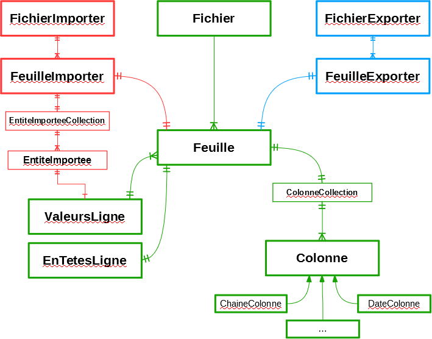

# Les modèles de l'import et de l'export

[💽 Télécharger](Modele_ImportExport.odg) ([SVG](Modele_ImportExport.svg))

## Les modèles génériques

(en vert sans le schéma)

Ces modèles sont à la fois utilisés pour l'import et l'export.

Le **`Fichier`** représente un fichier d'import ou d'export `*.xlsx` et possède une à plusieurs **`Feuille`**.

La **`Feuille`** est la représentation d'une feuille Excel et possède :
* Une **`ColonneCollection`** : représentation de toutes les colonnes de la feuille ;
* Un **`EnTetesLigne`** : représentation de la première ligne (titres des colonnes) ;
* Des **`ValeursLigne`** : représentation d'une ligne de valeurs ;

Les colonnes de **`ColonneCollection`** sont de différents types :
* **`ChaineColonne`** ;
* **`DateColonne`** ;
* **`EntierColonne`** ;
* Etc.

## Les modèles de l'import

(en rouge sans le schéma)

Le **`FichierImporter`** est un service permettant d'importer un fichier Excel.
Il est associé à plusieurs **`FeuilleImporter`** s'occupant chacun d'importer une **`Feuille`** associée.

Pour chaque **`ValeursLigne`** importée est créée une **`EntiteImportee`** dans l'**`EntiteImporteeCollection`** qui est associée à la feuille.

## Les modèles de l'export

(en bleu sans le schéma)

Le **`FichierExporter`** est un service permettant d'exporter un fichier Excel.
Il est associé à plusieurs **`FeuilleExporter`** s'occupant chacun de créer leur **`Feuille`** associée.
