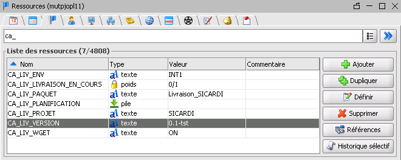
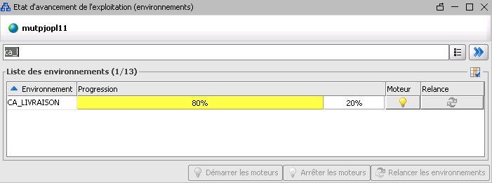
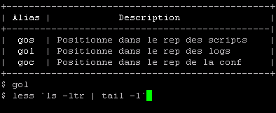

# La livraison du paquet sur INT

Note : INT est le seul environnement dans lequel l’équipe de développement peut livrer des paquets.
Pour les autres environnements, une demande doit être faite au BT.

## Le démarrage de VTOM

* Se connecter au serveur de rebond ;
* Lancer l'application `IHM Visual TOM` ;
* Se connecter avec les valeurs suivantes :
  * Compte : *Compte nominatif* ;
  * Mot de passe : *Votre mot de passe correspondant*;
  * Domaine : `172.26.1.162` ;
  * Port : `30007` ;


## La définitions des ressources

* Double-cliquer sur `Ressources` dans le menu de gauche ;
* Filtrer les résultats commençant par `CA_LIV_` ;
* Définissez les valeurs suivantes (pour INT1 par exemple) :
  * CA_LIV_ENV : `INT1` ;
  * CA_LIV_LIVRAISON_EN_COURS : `0/1` ;
  * CA_LIV_PAQUET : `SICARDI` ;
  * CA_LIV_VERSION : `X.Y.Z`.


## Le redémarrage des moteurs

* Cliquer sur l'onglet `Pilotage` ;
* Cliquer sur `SupraManager...` ;
* Filtrer sur l'environnement `CA_LIVRAISON` ;



### L'arrêt des moteurs

* Cliquer sur l'icône 💡 de la colonne `Moteur` ;
* Cliquer sur le bouton `💡 Arrêter les moteurs` ;
* Valider en cliquant sur `✔️ Ok`.

### La relance des environnements

* Cliquer sur l'icône 🔄 de la colonne `Relance` ; 
* Cliquer sur le bouton `🔄 Relancer les environnements` ;
* Cocher la case sous `Mettre à venir` ;
* Valider en cliquant sur `✔️ Ok`.

### Le démarrage des moteurs

* Cliquer sur l'icône 💡 de la colonne `Moteur` ;
* Cliquer sur le bouton `💡 Démarrer les moteurs` ;
* Valider en cliquant sur `✔️ Ok`.

## Le lancement de la livraison

⚠️ La livraison doit être lancée 10 minutes minimum après la publication du paquet sur Venezio.

* Dans le menu de gauche, déplier `Environnements` ;
* Double-cliquer sur `CA_LIVRAISON` ;
* Cliquer droit sur l'icône `[D] CA_Init` ;
* Cliquer sur `Actions` / `Demander` ;
* Confirmer en cliquant sur `Oui`.

## En cas d'erreur

Si une erreur intervient au cours de l'installation, l'icône `CA_Installation` deviendra rouge.

Dans tous les cas, peu après la fin du processus, l'ensemble des icônes redeviendra `jaune`.

En double-cliquant sur un icône, on peut avoir le détail du processus et un clic droit permettra d'accéder au `Log`.

Les causes possibles sont :

* Une entité Doctrine mise en `final` (Doctrine crée des entités `Proxy` qui héritent nos entités en environnement `prod`).
* Une partition pleine. Vérifier l'espace disponible avec Grafana ou en se connectant en `root` sur le serveur et lancer la commande `df -h`.

## La modification du script de livraison

Les scripts de livraison sont copiés dans le paquet de livraison.
Il faut les modifier directement sur le [serveur DEV](./Serveurs.md#serveur-dev) en tant que `pacadmin` :

```shell script
vi /home/pacadmin/livraison/SICARDI_AS_Livraison.act
```

## Le suivi des livraisons

### Le suivi du déploiement

* Se connecter sur le serveur en tant que `dplexploit` ;
* Utiliser la commande `gol` pour se rendre au registre du déploiement ;
```shell script
gol
```
* Le fichier de registre peut ensuite être suivi durant le déploiement avec la commande `tail -f` sur le fichier le plus récent ou la commande `less` pour lire le fichier du début à la fin.



Par exemple, la commande suivante permet de lire le dernier fichier :

```shell script
less `ls -1tr | tail -1`
```

### Les fichiers de registre

La commande `gol` se rend vers le dossier `/exploit/livraison/logs`.

Les différents dossier de registre sont :

```
/exploit/livraison/logs
/exploit/httpd-sicardi/logs
```
