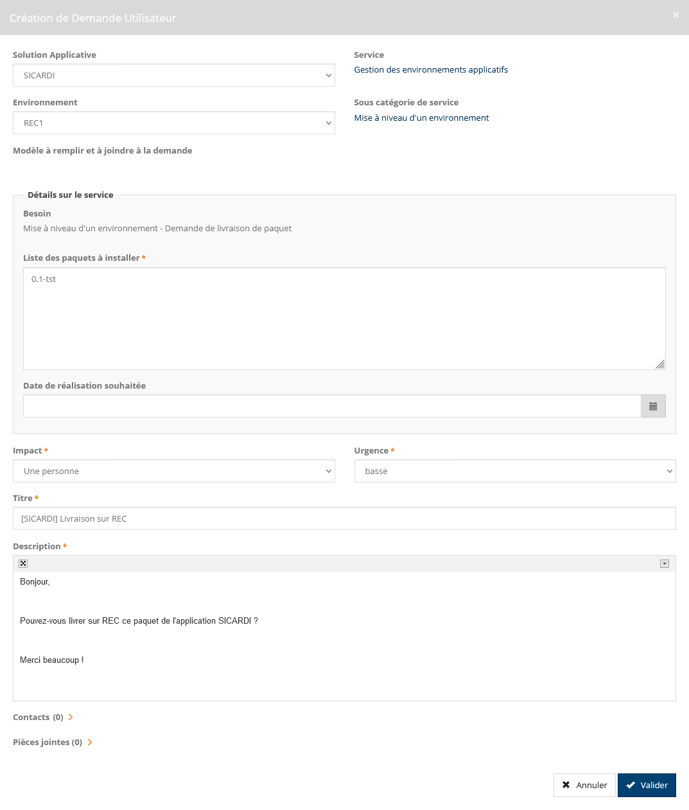

# La livraison du paquet sur REC / FOR / PRD

Cette livraison doit être demandée par l’équipe de développement au BT.

## Créer un paquet de type PROD

Les paquets qui ont vocation à être mis en production doivent être créés dans Nexus dans `sicardi-raw-writeonce`.

Il faut donc [créer un nouveau paquet de livraison](CreationPaquetLivraison.md) pour la production.

Mais au lieu de créer un paquet à partir de la branche (qui a pu évoluer depuis la création du dernier paquet) celui-ci sera créé à partir de l'étiquette Git générée lors de la génération du paquet dans `sicardi-raw-deploy`.

On va donc créer notre paquet via la commande :

```shell script
./livraison/livraison.sh X.Y.Z --prod
```

## La création d'une demande de livraison

* Se connecter sur iTop ;
* Dans le menu, cliquer sur `Nouvelle requête` ;
* Cliquer sur le bloc `Gestion des applications` ;
* Cliquer sur le bloc `Gestion des environnements applicatifs` ;
* Cliquer sur le bloc `Mise à niveau d'un environnement` ;
  * Solution applicative : `SICARDI` ;
  * Environnement : Par exemple `REC1` ;
  * Liste des paquets à installer : Le nom de votre paquet, par exemple `0.1-rel` ;
  * Date de réalisation souhaitée : Optionnelle ;
  * Titre : Par exemple `[SICARDI] Livraison sur REC1` ;
  * Description : Par exemple
```text
Bonjour,

Pouvez-vous livrer sur REC1 ce paquet de l'application SICARDI ?

Merci beaucoup !
```



Note : Le plus simple est encore d'afficher la dernière demande de déploiement pour l'environnement en question et de cliquer sur `Copier la demande...` et de renseigner la version.

## La mise en production

Avant qu'un paquet soit mis en production, il faut que celui-ci soit préalablement déployé sur REC et recetté.

La demande est à envoyer à Idir avec les informations suivantes :

* Le nom du paquet (par exemple `1.2.12-liv`) et son URL sur Venezio ;
* Le fichier de variables (généralement le dernier fichier de variables) et son URL sur Venezio.

Pour ces informations, le lien vers le fichier dans Venezio doit également être envoyé.

* Cliquer sur l'onglet `Projets` ;
* Cliquer sur `INNOVATIONS` ;
* Cliquer sur `SICARDI` ;
* Cliquer sur l'onglet `Fichiers` ;
* Récupérer les liens sous `Livraison_SICARDI` pour le paquet et sous `Variables` pour le fichier de variables.

Chaque livraison en production doit être enregistrée (y compris feuille de route) avant jeudi midi afin qu'elle soit prise en compte au CAB de vendredi.

L'installation en production doit toujours se faire la semaine suivante dans un créneau bien défini, c'est-à-dire du lundi 14h00 au vendredi matin avant 12h00.

Toute demande de changement normale en dehors de ce créneau sera rejetée par le BT.
Un changement urgent doit être aussi mesuré et par ailleurs en avoir le recours uniquement si le niveau d'impact et d'urgence est élevé.
