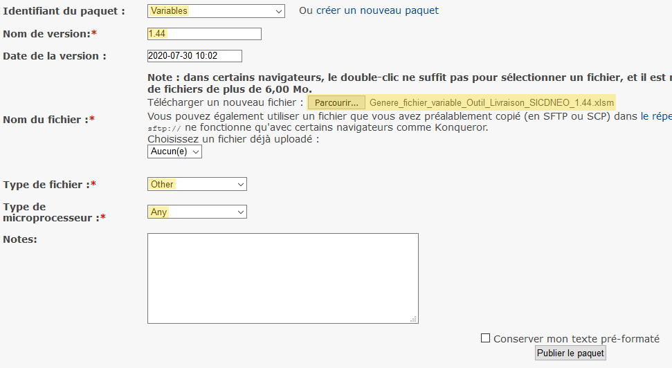

# Les serveurs

## Le compte nominatif

### La demande d'un compte nominatif

Le compte nominatif doit être demandé au BT via iTop.

### Le mot de passe

Le mot de passe du compte nominatif est valable 2 mois.
Après cette période, les accès seront fermés (mot de passe qui échoue ou fenêtre qui se ferme inopinément par exemple) ; dans ce cas, il suffit de se connecter au [serveur de rebond](#serveur-rebond) pour saisir un nouveau mot de passe.

## <a name="serveur-rebond"></a> Le serveur de rebond

Le serveur de rebond permet de se connecter aux serveurs `DEV` (indispensable si utilisation de Totem) et `INT`.

### La connexion depuis le CISIRH

* Se connecter via la `connexion à distance` en utilisant l'ordinateur `asopjrbw11-a.prodj.cisirh` ou `asopjrbw12-a.prodj.cisirh` ;
* Et en utilisant votre compte nominatif préfixé par `PRJ\` ; par exemple : `PRJ\rleclerc-ext`.

Il peut ne pas être possible de s’y connecter avec les portables DELL s'il n'y a pas d'IP fixe.

### La connexion avec Totem

* Se connecter via la connexion à distance en utilisant l'ordinateur `asopjrbw11-a.prodj.cisirh:8443` ou `asopjrbw12-a.prodj.cisirh:8443` ;
* Et en utilisant votre compte nominatif préfixé par `PRJ\` ; par exemple : `PRJ\rleclerc-ext`.

## <a name="serveur-dev"></a> Le serveur DEV

#### Les informations serveur

* Système : Red Hat Enterprise Linux Server 7.8 (Maipo)
* Adresse IP : 172.26.129.199
* Nom : cardjasl01-a.dev.cisirh
* Port : 22
* Sources : `/produit/httpd-sicardi/docroot`
* Logs : `/exploit/httpd-sicardi/logs`

#### Les informations SGBD

* Port : 20065
* Base de données : `MUT_DVPTT82_SICARDI_TRANSAC`
* Utilisateur : `CA_D1_PHP`
* Mot de passe : *Par defaut*

### L'accès depuis le CISIRH

* Avec Putty, se connecter au serveur `172.26.129.199`;
* Se connecter avec son compte nominatif (par exemple `rleclerc-ext`).

### L'accès avec Totem

* Il faut au préalable se connecter au [serveur de rebond](#serveur-rebond) (cf. La connexion avec Totem) ;
* Avec Putty, se connecter au serveur DEV avec `cardjasl01-s.dev.cisirh` (l'IP ne fonctionne pas) ;
* Se connecter avec son compte nominatif (par exemple `rleclerc-ext`).

#### Redémarrer le serveur

```shell script
sudo su - httadmin
sudo /bin/systemctl restart httpd-sicardi
```

## <a name="serveur-int"></a> Le serveur INT

#### Les informations serveur

* Système : Red Hat Enterprise Linux Server 7.08 (basé sur les dépôts officiels RHEL) 
* Adresse IP : 172.26.5.140
* Nom : carijasl01-a.int.cisirh
* Port : 22
* Sources :
```
/produit/httpd-sicardi/int1/docroot
/produit/httpd-sicardi/int2/docroot
/produit/httpd-sicardi/int3/docroot
```
* Logs :
```
/exploit/httpd-sicardi/int1/logs
/exploit/httpd-sicardi/int2/logs
/exploit/httpd-sicardi/int3/logs
```

#### Les informations SGBD

* Port : 61100
* Base de données : `MUT_ITPTT82_SICARDI_TRANSAC`
* Utilisateur : `CA_I1_PHP` / `CA_I2_PHP` / `CA_I3_PHP`
* Mot de passe : *Par defaut*

#### L'accès

L'accès se réalise exclusivement depuis le serveur de rebond.

```shell script
ssh rleclerc-ext@carijasl01-a.int.cisirh
```

#### Redémarrer le serveur

```shell script
sudo su - httadmin
sudo /bin/systemctl restart httpd-sicardi-int1
sudo /bin/systemctl restart httpd-sicardi-int2
sudo /bin/systemctl restart httpd-sicardi-int3
```

### Le manque d'espace

Pour vérifier l'espace disque :

* Se connecter au [serveur INT](#serveur-int) avec votre compte nominatif ;
* Se connecter en `root` :
```shell script
sudo su -
```
* Utiliser `df` :
```shell script
df -h
```

Il faut notamment s'assurer qu’il y a assez d'espace dans la partition `/produit/httpd-sicardi`.

## Le serveur REC

L'équipe de développement n'est pas autorisée à se connecter à ce serveur.

## Le serveur FOR

L'équipe de développement n'est pas autorisée à se connecter à ce serveur.

## Le serveur PRD

L'équipe de développement n'est pas autorisée à se connecter à ce serveur.

## Le fichier de variables

Le fichier de variables contient les variables spécifiques à chaque environnement (INT1, REC1, etc).

### La récupération du dernier fichier de variables

Le dernier fichier de variables est téléchargeable depuis [Venezio](./Applications.md#venezio), il s’agit des paquets `Variables`.

* Cliquer sur l'onglet `Projets` ;
* Cliquer sur `INNOVATIONS` ;
* Cliquer sur `SICARDI` ;
* Cliquer sur l'onglet `Fichiers` ;
* Sous `Variables`, cliquer sur la dernière version pour le télécharger (`Genere_fichier_variable_Outil_Livraison_SICARDI_x.y.xlsm`).

### La génération du fichier valorisé

Dans le fichier Excel, après avoir effectué ses modifications :

* Enregistrer le fichier sous une nouvelle version incrémentée ;
Par exemple,
`Genere_fichier_variable_Outil_Livraison_SICARDI_1.11.xlsm`
devient
`Genere_fichier_variable_Outil_Livraison_SICARDI_1.12.xlsm`
* Si les macros sont désactivées, cliquer sur le bouton `Activer le contenu` (dans la barre jaune d'avertissement de sécurité) ;
* Cliquer sur le bouton `GENERER` ;

Le fichier sera enregistré sous le nom `liv_conf_valorise.cfg`.

### La mise en place du fichier valorisé

#### Sur INT

* Se connecter au serveur en tant que `dplexploit` ;
* Remplacer le contenu du fichier valorisé :

```shell script
vi /exploit/livraison/conf/SICARDI/liv_conf_valorise.cfg
# Supprimer le contenu du fichier
:%d
# S’apprêter à écrire
i
# Coller tout le contenu de votre liv_conf_valorise.cfg (avec clic droit par exemple)
# Enregistrer
:w
# Ou si le fichier est protégé
:w!
# Quitter
:q
```

#### La prise en compte

Après avoir mis à jour le fichier sur le bon serveur, la création d'un nouveau paquet – et donc d'un nouveau déploiement – est nécessaire pour que celui-ci soit pris en compte.

#### Sur les autres environnements

Pour chaque environnement dont on n'a pas la main, il faudra renseigner la version du nouveau fichier lors de la demande de déploiement.

### L'enregistrement du fichier de variables

Une fois le fichier de variables à jour sur le serveur, le téléverser sur Venezio :

* Cliquer sur `Pour créer une nouvelle version, cliquez ici.` ;
* Saisir les données et télécharger le fichier Excel :

* Cliquer sur `Publier le paquet` ;
* Avertir ensuite le BT (Thierry Goujon) que le fichier a été modifié.

## Les tâches planifiées

### Sur INT

* Se connecter en tant que `httadmin` ;
* Éditer le cron :

```shell script
crontab -e
```

Il est nécessaire d'appeler le fichier de profil pour que les variables d'Oracle soit prises en compte.
Par exemple :

```text
0 1 * * * . $HOME/.bash_profile; /opt/rh/rh-php73/root/usr/bin/php -c /produit/httpd-sicardi/conf.d/php.ini /produit/httpd-sicardi/docroot/SICARDI/bin/console app:agent:mise-a-jour-experience
```

Cette commande Symfony sera exécutée tous les jours à une heure du matin.

Les différentes commandes à être exécutées tous les jours sont :

```text
app:agent:mise-a-jour-experience
app:agent:mise-a-jour-type-agent
app:ingres:synchronise
app:traces:purge
app:traces:purge -t true
app:statistique-utilisation:mise-a-jour
```

Si une commande enregistre les erreurs dans un nouveau fichier, penser à mettre à jour le `logrotate` pour tous les environnements.
